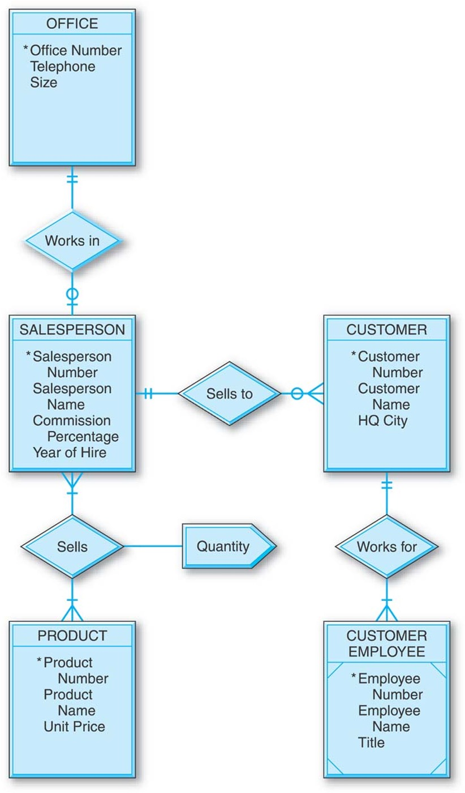
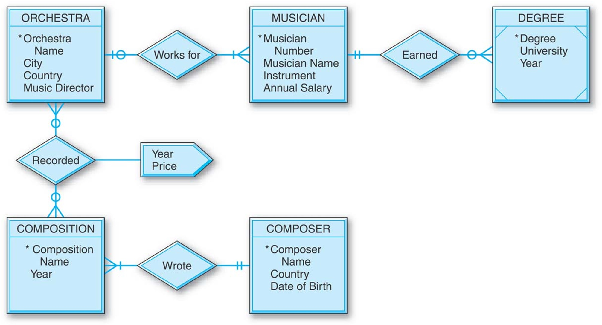
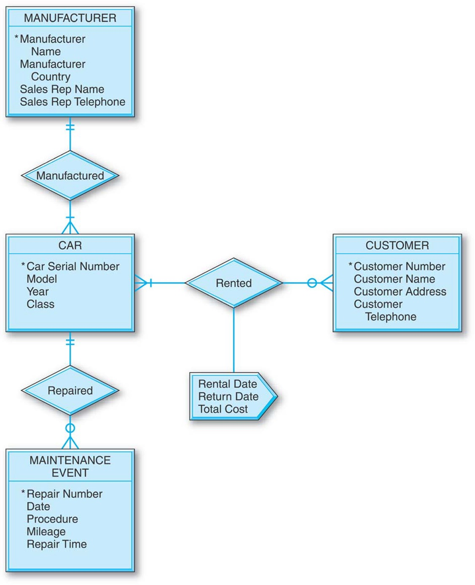

# Homework 2: Logical Data Modeling

**Course:** TIF2242 – Database Systems  
**Instructor:** Dr. Guntur D Putra  
**Due Date:** [Monday, 9 March 2026 at **07.59**]

In Assignment 1 you produced a Peter Chen ER diagram for the **UGM‑Fezz** social‑media app. This task takes that conceptual design and turns it into a **logical** (relational) schema.

## Objectives

1. **Map the ER constructs** from conceptual model to relations.
2. **Specify keys & constraints** – primary keys, foreign keys, (unique, not‑null).
3. Include a logical‑model diagram (Crow’s‑Foot). You may want to use [https://dbdiagram.io/](https://dbdiagram.io/).

## Part 1: UGM-Fezz Modeling (40 Points)
Convert your previously modeled *UGM-Fezz* into logical database design with Crow's Foot notation. Please be mindful with the entity types, attribute types, the cardinality of the relation, etc.

## Part 2: Logical Modeling for Other Conceptual Design (60 Points)
Please conver the following conceptual database design into logical data modeling with Crow's Foot diagram.

1. **General Hardware Company Database**

2. **World Music Association Database**

3. **Lucky Rent-a-Car Database**

## Submission Instructions
* You may use tools like [https://dbdiagram.io/](https://dbdiagram.io/), **Draw.io** (select the "Entity Relation" library), or draw clearly by hand and scan your work.  
* Ensure all symbols follow the standard notation.
* Submit your answers in PDF format via eLOK. Remember to include your name and student id in your PDF file.
